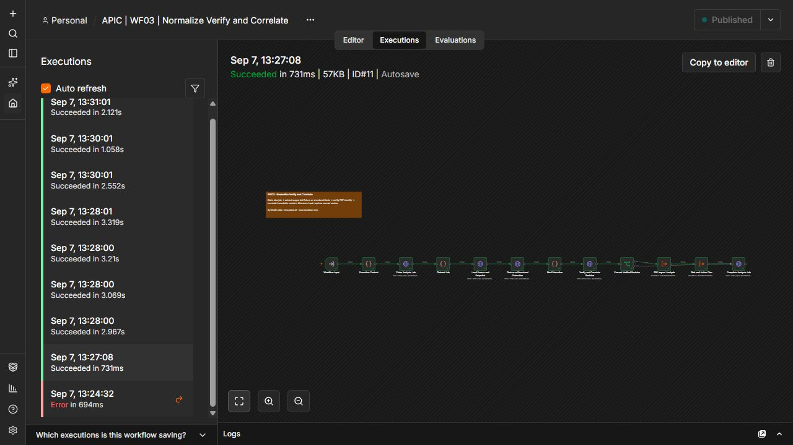

# AI Production Incident Control

[](https://github.com/Mvstnz/ai-production-incident-control/actions/workflows/ci.yml)


> From an unstructured manufacturing incident to verified operational impact, a human-approved response and an auditable action trail.

Manufacturing teams often receive disruptions as unstructured messages and then manually connect supplier statements, inventory, production demand and customer commitments. That slows down response, makes assumptions difficult to audit and creates a risk that an unverified AI interpretation or a duplicate retry triggers the wrong action.

AI Production Incident Control is a runnable portfolio project for handling supplier delays, machine breakdowns and quality issues. Ten visible n8n workflows coordinate a FastAPI Operations service, a separate synthetic ERP, PostgreSQL and a React dashboard. An optional Gemini path can interpret a freely edited supplier email, but source evidence, ERP data and versioned rules remain authoritative.

**The core idea:** AI interprets and drafts. Deterministic services verify facts and calculate impact. People authorize consequential actions.


## What this project demonstrates

| Capability                 | Implementation                                                                                                                                |
| -------------------------- | --------------------------------------------------------------------------------------------------------------------------------------------- |
| Multi-channel intake       | Synthetic email, API and form events enter the same durable processing contract.                                                              |
| Guarded AI extraction      | Gemini may propose typed facts, but exact source quotes, offsets, schema rules and ERP identity checks decide whether they are accepted.      |
| Operational impact         | Time-based material allocation, capacity checks and lot traceability compare the original plan with the incident scenario.                    |
| Explainable prioritization | A versioned policy calculates every risk factor and severity; the language model cannot change the score.                                     |
| Human-in-the-loop control  | Approvals bind the exact revision, action parameters, recipient, subject and message body before dispatch.                                    |
| Reliable execution         | Transactional outbox records, leases, bounded retries, idempotency keys, unknown-outcome handling and a dead-letter path cover failure cases. |
| Auditable operations       | The dashboard shows source evidence, immutable revisions, impact, risk, approvals, actions and workflow execution references.                 |

Everything uses isolated synthetic data. Emails are captured by local Mailpit, tickets stay inside the sandbox and ERP commands affect only the mock service. A sent notification moves an incident to monitoring; it does not falsely mark the operational problem as resolved.

## Demonstrated scenarios

| Scenario                | Verified result                                                                                                                 | Controlled action                                                                                      |
| ----------------------- | ------------------------------------------------------------------------------------------------------------------------------- | ------------------------------------------------------------------------------------------------------ |
| Supplier delay          | 38 required, 14 covered, 24 short; two production orders affected; EUR 126,400 affected open-order value; **88 / CRITICAL**     | Exact supplier response requires approval. An unconfirmed partial delivery remains a what-if scenario. |
| Confirmed 10 + 30 split | The supply plan is replaced rather than duplicated; shortage falls to 14; one order remains affected; EUR 54,400; **69 / HIGH** | A new revision supersedes stale approvals.                                                             |
| Machine breakdown       | 8 of 16 required hours are unavailable; a qualified alternative exists; **52 / HIGH**                                           | Synthetic rescheduling requires Production Manager approval.                                           |
| Quality issue           | A verified failed inspection is traced through lot and pending shipment; **CRITICAL hard override**                             | Blocking requires Quality Manager approval; release is a separate decision.                            |

The monetary values are affected open sales positions, not predicted losses or claimed savings.

## Architecture


n8n owns orchestration, branches, waits and recovery. FastAPI owns authenticated state changes, transactions and reusable domain calculations. PostgreSQL is the business source of truth; n8n's internal tables are not used as application storage.



## Quick start

### Prerequisites

- Docker Engine with Compose
- Python 3.12
- Git
- [RTK](https://github.com/rtk-ai/rtk)

Node.js 24.12.0 and npm are only needed for a source frontend build; the Compose build supplies Node itself. Exact versions and image digests are pinned in [versions.lock](versions.lock).

### Start the complete local demo

```powershell
git clone https://github.com/Mvstnz/ai-production-incident-control.git
cd ai-production-incident-control
rtk proxy python scripts/bootstrap.py
```

Bootstrap generates random local credentials, starts the services, applies migrations, seeds the synthetic ERP, imports and publishes all ten local workflows, builds the dashboard and creates three real workflow-backed showcase incidents. Re-running it preserves existing secrets and workflow identities.

| Service              | Local address              |
| -------------------- | -------------------------- |
| Operations dashboard | http://127.0.0.1:5173      |
| n8n editor           | http://127.0.0.1:5678      |
| Operations OpenAPI   | http://127.0.0.1:8000/docs |
| Mailpit inbox        | http://127.0.0.1:8025      |

Sign in with one of the generated accounts in **`.local/credentials.json`**. Available roles are viewer, operator, purchasing, production manager, quality manager and admin. Keep `.local/` and `.env` private.

## Try the demo

1. Open the dashboard and select **Run demo → Supplier delay**.
2. Inspect the verified source, allocation, affected orders and six-factor risk calculation.
3. Review the exact proposed action in **Approval inbox**.
4. Approve it as the appropriate manager and inspect the single captured message in Mailpit.
5. Run the confirmed split revision and verify that the old approval can no longer authorize the changed plan.
6. Repeat with the machine and quality scenarios, then inspect retries and execution references under **Reliability**.

For a guided explanation, use the [demo walkthrough](docs/demo-guide.md) and [portfolio interview narrative](docs/portfolio.md).

## Key design decisions

| Question                           | Decision                                                                                                                                                                                                                        |
| ---------------------------------- | ------------------------------------------------------------------------------------------------------------------------------------------------------------------------------------------------------------------------------- |
| Why n8n?                           | The workflow canvas keeps triggers, branches, approval waits, adapters and recovery inspectable. Transactional state changes stay in the backend where concurrency can be tested.                                               |
| Why not let the LLM do everything? | Language models help with interpretation and drafting. Source evidence, ERP facts and deterministic rules own quantities, dates, financial values, severity and authorization.                                                  |
| How are duplicate sends prevented? | Durable source identities, versioned plan hashes, unique action keys, a transactional outbox and a final approval check control retries. Unknown provider outcomes stop for reconciliation instead of being sent blindly again. |
| Why this risk score?               | It is a transparent, versioned demo policy with tested boundaries, not a probability model. Every factor and business assumption is visible.                                                                                    |
| What changes with a live ERP?      | The synthetic adapters would be replaced by authorized contracts, real resource and calendar semantics, provider-specific idempotency and organization-approved security and approval policies.                                 |

## Check your own sample supplier email with Gemini

The normal guided demos use a deterministic fixture provider and require no external API. To enable the bounded live path, add the following values to the private, ignored `.env` and rerun bootstrap:

```dotenv
AI_MODE=live
LLM_MODEL=models/gemini-3.1-flash-lite
LLM_API_KEY=<your-key>
LLM_MAX_CALLS=<positive-limit>
```

Then choose **Run demo → Analyze with Gemini**, edit the subject and body and select **Check sample mail**. The sender remains fixed to `supplier@example.test`, and the form does not send an email.

Every real provider attempt consumes one durable budget slot. The key is imported into the local n8n credential store and never enters workflow JSON, evidence or Git. Prompt-like instructions, missing evidence, invented values, ambiguous confirmation, unsupported attachments and ERP mismatches result in `MANUAL_REVIEW`. Model output can never supply recipients, action types, business keys, severity or authorization.

## Verification

The latest hosted pipeline runs the full stack on a fresh Ubuntu runner:

- **108 unit tests** for impact, risk, verification and control rules
- **32 integration tests** against a real isolated PostgreSQL database
- **10/10 local n8n runtime scenarios** through published workflows
- frontend build and typecheck
- repeated bootstrap and workflow readback
- repository secret scan

One separately authorized synthetic Gemini smoke run also completed through the guarded local path: n8n execution `3285`, **88 / CRITICAL**, with the proposed partial delivery preserved as unconfirmed. This proves connectivity and the control path, not general model accuracy. See the [live smoke evidence](evidence/workflow-runs/live-gemini-mail-smoke.json).

Run the main checks locally:

```powershell
rtk proxy python -m pip install -r backend/requirements.lock.txt
rtk proxy python -m pytest tests/unit -q
rtk proxy python -m backend.run_integration
rtk proxy python -X utf8 scripts/test_runtime.py
rtk npm ci
rtk npm run build
rtk proxy python scripts/scan_repository.py
```

Additional ordering, resilience and live-provider checks are documented in the [executed test report](docs/implementation/test-report.md). The acceptance matrix retains the exact boundary and evidence for every criterion.

## Current status and boundaries

| Boundary                    | Status                                                                                                                                             |
| --------------------------- | -------------------------------------------------------------------------------------------------------------------------------------------------- |
| Complete local fixture demo | **Tested** — all ten workflows execute locally with PostgreSQL, the APIs and dashboard.                                                            |
| Guarded local Gemini path   | **Smoke tested** — one synthetic live-provider execution passed; this is not a statistical evaluation.                                             |
| GitHub CI                   | **Passing** — fresh containerized bootstrap, tests, runtime scenarios and secret scan.                                                             |
| n8n Cloud graph             | **Deployed and read back, but configuration blocked and inactive** — the isolated Gemini credential probe passed; the core graph was not executed. |
| Connected cloud end-to-end  | **Blocked** — reachable Operations/ERP HTTPS services and their service credentials have not been supplied.                                        |

No productive workflow, real recipient or real ERP is connected. `EXTERNAL_ACTIONS_ENABLED=false` remains the safe default. The exact cloud boundary is recorded in [remaining blockers](docs/BLOCKERS.md) and [target deployment evidence](evidence/workflow-runs/target-deployment.json).

## Project map

- [System architecture](docs/architecture.md) and [data model](docs/data-model.md)
- [Security controls](docs/security.md) and [known limitations](docs/limitations.md)
- [Workflow inventory](docs/implementation/workflow-inventory.md) and [implementation progress](docs/implementation/progress.md)
- [Acceptance matrix](acceptance/acceptance-matrix.json) and [executed test report](docs/implementation/test-report.md)
- [Local workflow evidence](evidence/workflow-runs/local-e2e.json), [resilience evidence](evidence/workflow-runs/resilience.json) and [screenshots](evidence/screenshots)
- [Handover, rollback and recovery](docs/implementation/handover.md)

The authoritative build specification is [CODEX_BUILD_SPEC.md v1.1](CODEX_BUILD_SPEC.md). Archived plans are retained for provenance only.

## Stop and resume

```powershell
rtk docker compose stop
rtk docker compose up -d
```

Volumes preserve application data, n8n state and Mailpit messages. Before a local workflow update, the deployment script stores a rollback copy under `.local/rollback-WFxx.json`. Restore only identified APIC workflows by following the [handover guide](docs/implementation/handover.md).

## Responsible portfolio use

This repository contains no customer data and claims no production deployment or measured financial savings. It demonstrates production-oriented design choices in a controlled environment. The implementation was developed with AI assistance; the portfolio value lies in the documented domain model, orchestration boundaries, safety controls, trade-offs and reproducible evidence.
