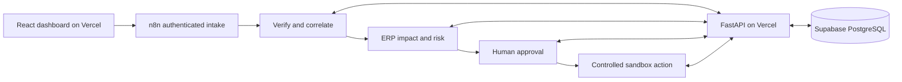

# AI Production Incident Control

A manufacturing demo that turns a reported problem into a verified impact assessment, an approval and a traceable sandbox action.

[Open the live demo](https://ai-production-incident-control-dash.vercel.app) and select **Explore the workspace**. Public visitors can inspect the three shared examples. Operational accounts can create private scenarios and approve actions.

The products are ordinary manufacturing materials. Every company, order, inspection and operational record is invented for this portfolio.

## Three everyday examples

| Example | What happened | Calculated impact |
| --- | --- | --- |
| Steel rods delayed | A truck carrying 75 steel rods breaks down. The rods are 20 mm in diameter and 2 m long, and are needed for four orders for welded mounting frames. | 24 rods initially available, 40 missing at the required dates, two affected production orders, EUR 55,400 exposure; **83 / CRITICAL**. |
| Band saw S-01 stops | A drive belt breaks. The saw is unavailable for two days. Saw S-02 has six free hours and can take over one job; a drill press cannot cut bars. | 10 of 16 required cutting hours uncovered, two affected orders; **62 / HIGH**. Rescheduling requires approval. |
| Mounting-plate holes are too large | An inspection finds 11 mm holes where the drawing specifies 10 mm. A batch of 48 plates is allocated to two pending shipments. | Both shipments traced to the affected batch; **70 / CRITICAL** with a verified quality override. Blocking shipments requires quality approval. |

The supplier also offers an unconfirmed early delivery of 30 rods. It stays outside confirmed supply. A confirmed 30 + 45 split replaces the original schedule, reduces the shortage to 10 rods and lowers the assessment to **56 / HIGH**, with EUR 21,600 exposure.

## How it works



Ten n8n workflows separately handle intake, normalization, ERP impact, risk, approvals, actions, recovery, errors and digests. FastAPI owns short database transactions and deterministic calculations. A separate ERP API contract protects synthetic inventory, capacity and shipment commands, even when both APIs share a Vercel deployment.

Public access is read-only and limited to the shared demo scope. Operational accounts require login, role checks, scope membership and CSRF protection. Approval binds the exact plan version, hash, recipient, text and command parameters. A notification does not resolve the operational problem. Unknown delivery outcomes require reconciliation instead of blind retries.

Supabase uses private `ops` and `erp` schemas with separate runtime roles. Database passwords and service tokens remain in Vercel environment variables and n8n credentials. The migration role stays local.

## Sandbox boundaries

The hosted demo uses deterministic fixture extraction. The optional Gemini integration remains available in the code, but live model calls are disabled on this deployment. It makes no claim about general language-model accuracy.

Supplier emails are captured in PostgreSQL; they are never delivered to real suppliers. Saw rescheduling and shipment blocks affect only the synthetic ERP. Recovery runs after completed analyses and approval decisions, with an hourly fallback; management digests are generated daily. The connected n8n instance is currently a trial, so its continued availability depends on that account.

## Run locally

```powershell
python scripts/bootstrap.py
```

Docker and Python are required; the bootstrap creates local credentials, builds services, applies migrations and publishes the local workflows. Local endpoints: dashboard `http://127.0.0.1:5173`, API `http://127.0.0.1:8000`, n8n `http://127.0.0.1:5678`, Mailpit `http://127.0.0.1:8025`. Local Mailpit and hosted database capture implement the same sandbox boundary.

## Verification and source

- [Demo guide](docs/demo-guide.md): source facts, calculations and approvals.
- [Deployment report](docs/implementation/hosting.md): environment, workflow IDs and observed results.
- [Unit tests](tests/unit/test_domain.py): allocation, capacity, traceability, risk and grounded extraction.
- [API integration tests](tests/integration/test_api.py): PostgreSQL state transitions, roles, isolation, idempotency and immutable history.
- [Fixture evaluation](evidence/evaluations/fixture-v2-report.json): 50 deterministic validation cases, zero model calls.
- [Live verification](evidence/workflow-runs/hosted-demo.json) and [approved actions](evidence/workflow-runs/hosted-actions.json).

Retired reference-product fixtures, invented brand-name examples and their screenshots have been removed from the current project. The canonical example inputs are the three JSON files under `fixtures/`.
