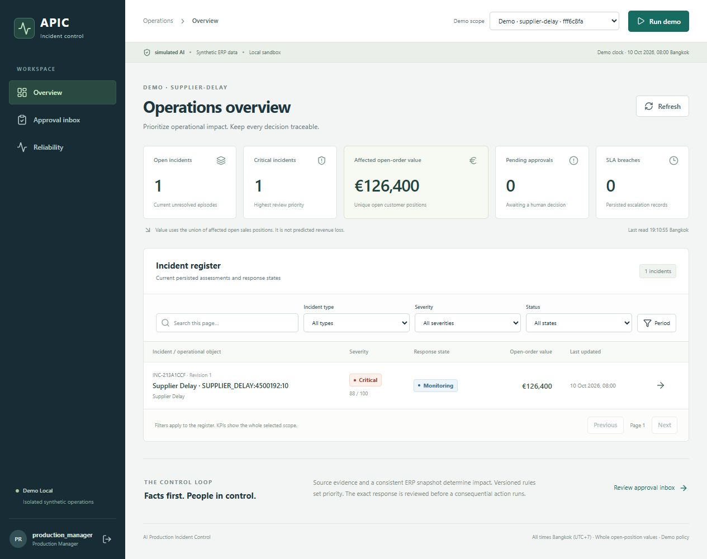

# AI Production Incident Control

Turn a manufacturing disruption into verified operational impact, an exact human-reviewed response and an auditable action trail. Ten visible n8n workflows coordinate a FastAPI Operations service, a separate synthetic ERP service, PostgreSQL and a React dashboard.

**This is a synthetic portfolio demo.** AI is simulated with a conservative fixture provider. Messages go to local Mailpit, tickets remain in the sandbox, and ERP changes affect synthetic data only. A completed notification leaves an incident in monitoring; resolution requires current operational evidence.

The local application has executed real n8n workflows. Cloud workflows have also been created and read back, but **connected sandbox execution remains blocked**. See [acceptance evidence](acceptance/acceptance-matrix.json), [workflow IDs](docs/implementation/workflow-inventory.md) and [remaining blockers](docs/BLOCKERS.md). Existing failures are preserved alongside subsequent results. No live LLM evaluation is claimed.



## Start locally

Prerequisites: Docker Engine with Compose, Python 3.12, Git and [RTK](https://github.com/rtk-ai/rtk). A source frontend build additionally uses Node 24.12.0 and npm; the Compose build supplies Node itself. The verified versions and image digests are in [versions.lock](versions.lock).

From this repository directory:

```powershell
rtk proxy python scripts/bootstrap.py
```

Bootstrap generates random local credentials once, starts persistent infrastructure, applies migrations, seeds the synthetic ERP, imports and publishes the ten local workflows, and builds the dashboard. It preserves existing secrets and deterministic workflow IDs on subsequent runs. Initial image download/build takes several minutes.

| Service | Local address |
|---|---|
| Dashboard | http://127.0.0.1:5173 |
| n8n editor | http://127.0.0.1:5678 |
| Operations OpenAPI | http://127.0.0.1:8000/docs |
| Mailpit inbox | http://127.0.0.1:8025 |

Sign in using one of the accounts in **`.local/credentials.json`**: viewer, operator, purchasing, production_manager, quality_manager or admin. Keep that file and `.env` private. An n8n owner account is only needed for its editor; workflows execute after CLI deployment. On this delivered workspace the local editor was configured and its generated login is in `.local/n8n-owner.json`.

Choose **Run demo → Supplier delay**. The persisted assessment computes 38 required, 14 covered at need, 24 shortage, two affected production orders, €126,400 and **88 CRITICAL**. The offered partial delivery appears separately. A confirmed 10 + 30 split replaces the supply schedule, producing 14 shortage, €54,400 and **69 HIGH**.

The machine fixture calculates **52 HIGH** and requires approval before rescheduling. The quality fixture traces a verified failed inspection to pending shipment and requires a Quality manager before blocking. Quality release is a separate proposal and approval.

## Verify

```powershell
rtk proxy python -m pip install -r backend/requirements.lock.txt
rtk proxy python -m pytest tests/unit -q
rtk proxy python -m backend.run_integration
rtk proxy python -X utf8 scripts/test_runtime.py
rtk proxy python -X utf8 scripts/test_resilience.py --phase normal
rtk npm ci
rtk npm run build
rtk proxy python scripts/scan_repository.py
```

The API suite uses a separate real PostgreSQL database, `apic_integration`. Runtime tests call the published local n8n webhooks and observe persisted results; they create new synthetic scopes. The resilience runner also has explicit restart/database phases documented in its help. Run disruption tests when other local demo users are idle.

`verify_handoff.py` is the original **handoff-package checker**, not an application test. It expects untouched NOT_RUN acceptance entries and should be run against the separately extracted v1.1 handoff, as recorded in [handoff validation](evidence/test-results/handoff-v1.1.json).

GitHub [CI](.github/workflows/ci.yml) defines the build, domain, API, local n8n and repository scan pipeline. Publication is in progress; a hosted CI pass is claimed only after its completed run is recorded in the acceptance matrix. Dependency versions and Action commits are pinned.

## Architecture and evidence

- [Architecture](docs/architecture.md), [data model](docs/data-model.md), [security](docs/security.md), [limitations](docs/limitations.md)
- [Demo walkthrough](docs/demo-guide.md), [portfolio narrative](docs/portfolio.md), [handover and rollback](docs/implementation/handover.md)
- [Milestone progress](docs/implementation/progress.md), [executed test report](docs/implementation/test-report.md), [API verification](docs/implementation/backend-verification.md)
- [Real local workflow runs](evidence/workflow-runs/local-e2e.json), [resilience](evidence/workflow-runs/resilience.json), [fixture evaluation](evidence/evaluations/fixture-v1-report.json)
- [Cloud deployment readback](evidence/workflow-runs/target-deployment.json), [screenshots](evidence/screenshots)

The source specification is [CODEX_BUILD_SPEC.md v1.1](CODEX_BUILD_SPEC.md). Archived earlier plans are retained only for provenance and must not be combined with it.

## Stop and rollback

```powershell
rtk docker compose stop
rtk docker compose up -d
```

Volumes preserve application data, n8n state and Mailpit messages. Before each local workflow update, the deploy script saves the prior owned workflow under `.local/rollback-WFxx.json`. Restore only an identified APIC workflow using the instructions in [handover](docs/implementation/handover.md). There is no automatic destructive volume reset or remote publication step.
