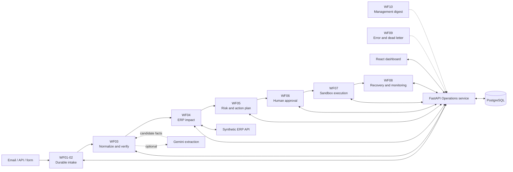

# AI Production Incident Control

[](https://github.com/Mvstnz/ai-production-incident-control/actions/workflows/ci.yml)


> From an unstructured manufacturing incident to verified operational impact, a human-approved response and an auditable action trail.

Manufacturing disruptions rarely arrive as clean data. A supplier sends an email, a machine reports downtime or a quality team files a finding. Someone must then connect that information to inventory, production demand and customer commitments before the organization can act safely.

AI Production Incident Control is a runnable portfolio system for that decision path. Ten visible n8n workflows orchestrate a FastAPI Operations service, a separate synthetic ERP, PostgreSQL and a React dashboard. An optional Gemini path can interpret a freely edited supplier email, but source evidence, ERP data and versioned business rules remain authoritative.

**Design principle:** AI interprets and drafts. Deterministic services verify facts and calculate impact. People authorize consequential actions.

**Portfolio focus:** AI automation, workflow orchestration, solutions engineering, process analysis and reliability-minded implementation.


## Project at a glance

| Area | What is implemented |
| --- | --- |
| Business scope | Supplier delays, machine breakdowns and quality issues using isolated synthetic data |
| Orchestration | Ten modular n8n workflows for intake, verification, impact, risk, approval, execution and recovery |
| Application | FastAPI services, PostgreSQL, a React/TypeScript dashboard and local Mailpit delivery |
| AI boundary | Optional Gemini extraction proposes candidate facts; backend validation decides what is accepted |
| Control model | Role-based approval binds the exact revision, recipient, message and action parameters |
| Reliability | Durable intake, immutable revisions, leases, bounded retries, transactional outbox, idempotency and dead-letter handling |
| Reproducibility | Docker Compose bootstrap, pinned versions, repeat-deployment checks and retained execution evidence |
| Current boundary | Complete local demo; connected cloud end-to-end is blocked and the cloud graph remains inactive |

## From incident to controlled action

1. **Capture the source.** Synthetic email, API and form inputs enter one durable envelope before the intake returns success.
2. **Verify the facts.** Source quotes, typed schemas, offset-aware dates and ERP identity checks separate confirmed facts from proposals or ambiguities.
3. **Calculate operational impact.** Time-based allocation, capacity checks and lot traceability compare the original plan with the incident scenario.
4. **Explain priority.** A versioned policy calculates each risk factor and severity. The language model cannot change the score.
5. **Approve the exact plan.** The responsible role sees the full recipient, subject, message, parameters, revision and plan hash before deciding.
6. **Execute inside the sandbox.** Approved actions create local tickets, captured emails or explicit mock ERP commands.
7. **Retain the evidence.** The dashboard links source facts, revisions, assessments, approvals, actions and n8n execution references.

A notification moves an incident to monitoring; it does not falsely mark the operational disruption as resolved.

## Demonstrated scenarios

| Scenario | Verified result | Controlled action |
| --- | --- | --- |
| Supplier delay | 38 required, 14 covered, 24 short; two production orders affected; EUR 126,400 affected open-order value; **88 / CRITICAL** | The exact supplier response requires approval. An unconfirmed partial delivery remains a what-if scenario. |
| Confirmed 10 + 30 split | The supply plan is replaced rather than duplicated; shortage falls to 14; one order remains affected; EUR 54,400; **69 / HIGH** | A new revision supersedes stale approvals. |
| Machine breakdown | 8 of 16 required hours are unavailable; a qualified alternative exists; **52 / HIGH** | Synthetic rescheduling requires Production Manager approval. |
| Quality issue | A verified failed inspection is traced through its lot to a pending shipment; **CRITICAL hard override** | Blocking requires Quality Manager approval; release is a separate decision. |

The monetary values are affected open sales positions, not predicted losses, claimed savings or measured business outcomes.

## Architecture and responsibility boundaries



- **n8n** owns orchestration, branching, waits, adapters and recovery.
- **FastAPI** owns authenticated state changes, atomic transactions and reusable domain calculations.
- **PostgreSQL** is the business source of truth; n8n's internal tables are not application storage.
- **The synthetic ERP** exposes explicit read and approved mock-command contracts instead of direct workflow access to ERP tables.
- **The dashboard** is an authenticated control surface backed by persisted application state rather than hard-coded showcase values.


## Reliability and safety by design

- Transport identity, business identity and fact revisions are handled separately, so a retry is not mistaken for a new incident.
- Confirmed supply and proposed supply remain distinct; a newly confirmed split replaces the prior schedule instead of inflating it.
- Immutable snapshots and versioned rules keep assessments reproducible.
- Approval is tied to the exact plan. Changed facts or content invalidate stale authorization.
- A transactional outbox, stable action keys and final revalidation control duplicate effects.
- A potentially accepted provider write becomes `UNKNOWN_OUTCOME` and stops for reconciliation instead of being sent blindly again.
- Prompt-like instructions, unsupported attachments, missing evidence, invented values and ERP mismatches route to `MANUAL_REVIEW`.
- User roles, internal service credentials, ERP credentials, CSRF checks and scope membership are separate authorization boundaries.
- External actions are disabled by default, recipients are allowlisted and all committed data is synthetic.

See the detailed [architecture](docs/architecture.md), [security controls](docs/security.md) and [known limitations](docs/limitations.md).

## Run the complete local demo

### Prerequisites

- Docker Engine with Compose
- Python 3.12
- Git
- [RTK](https://github.com/rtk-ai/rtk)

Node.js 24.12.0 and npm are needed only for a source frontend build. The Compose build supplies Node itself. Exact versions and image digests are pinned in [versions.lock](versions.lock).

```powershell
git clone https://github.com/Mvstnz/ai-production-incident-control.git
cd ai-production-incident-control
rtk proxy python scripts/bootstrap.py
```

Bootstrap generates random local credentials, starts the services, applies migrations, seeds the synthetic ERP, publishes all ten local workflows, builds the dashboard and creates three workflow-backed showcase incidents. Re-running it preserves existing secrets and workflow identities.

| Service | Local address |
| --- | --- |
| Operations dashboard | http://127.0.0.1:5173 |
| n8n editor | http://127.0.0.1:5678 |
| Operations OpenAPI | http://127.0.0.1:8000/docs |
| Mailpit inbox | http://127.0.0.1:8025 |

Sign in with one of the generated accounts in **`.local/credentials.json`**. Available roles are viewer, operator, purchasing, production manager, quality manager and admin. Admin is the application superuser and inherits every business-role permission while authentication, CSRF and scope checks remain enforced ([ADR 0005](docs/adr/0005-admin-superuser.md)). Keep `.local/` and `.env` private.

## Follow the guided demo

1. Open the dashboard and select **Run demo -> Supplier delay**.
2. Inspect the verified source, allocation, affected orders and six-factor risk calculation.
3. Review the exact proposed action in **Approval inbox**.
4. Approve it as the appropriate manager or as admin, then inspect the single captured message in Mailpit.
5. Run the confirmed split revision and verify that the old approval can no longer authorize the changed plan.
6. Repeat with the machine and quality scenarios.
7. Open **Reliability** to inspect retries, recovery and execution references.

For a longer walkthrough, use the [demo guide](docs/demo-guide.md). For interview preparation, use the [portfolio narrative](docs/portfolio.md).

## Check a sample supplier email with Gemini

The guided demos use a deterministic fixture provider and require no external API. The optional live path accepts a freely edited synthetic supplier email while keeping the sender fixed and all actions inside the sandbox.

Add the following values to the private, ignored `.env`, then rerun bootstrap:

```dotenv
AI_MODE=live
LLM_MODEL=models/gemini-3.1-flash-lite
LLM_API_KEY=<your-key>
LLM_MAX_CALLS=<positive-limit>
```

Choose **Run demo -> Analyze with Gemini**, edit the subject and body, then select **Check sample mail**. The form analyzes the text; it does not send an email.

Every real provider attempt consumes one durable budget slot. The key is imported into the local n8n credential store and never enters workflow JSON, evidence or Git. Model output cannot supply recipients, action types, business keys, severity or authorization.

One separately authorized synthetic Gemini smoke run completed through this guarded path: n8n execution `3285`, **88 / CRITICAL**, with the proposed partial delivery preserved as unconfirmed. This proves connectivity and the control path for one sample, not general model accuracy. See the [live smoke evidence](evidence/workflow-runs/live-gemini-mail-smoke.json).

## Verification and retained evidence

The repository keeps implementation claims tied to executable checks and sanitized evidence:

| Boundary | Retained result |
| --- | --- |
| Unit tests | **108 passed** for impact, risk, verification and control rules ([evidence](evidence/test-results/domain.txt)) |
| PostgreSQL API integration | **34 passed** against a real isolated database ([output](docs/implementation/api-integration-output.txt)) |
| Published local n8n runtime | **10/10 scenarios passed** through real workflows ([evidence](evidence/workflow-runs/local-e2e.json)) |
| Ordering and concurrency | Early approval delivery and ten concurrent first deliveries were exercised without duplicate sandbox effects ([report](docs/implementation/test-report.md)) |
| Runtime resilience | Retry-After, bounded 503 retries, n8n restart, database outage and unknown write outcomes were exercised ([evidence](evidence/workflow-runs/resilience.json)) |
| Browser verification | Persisted views, exact approval, role/scope checks, responsive navigation and matching n8n execution were checked ([evidence](evidence/test-results/browser.json)) |
| Fixture evaluation | 50 frozen synthetic cases: 30 development and 20 holdout ([report](evidence/evaluations/README.md)) |
| Repository hygiene | Frontend build, repeated bootstrap, workflow readback and repository secret scan are part of CI |

The [GitHub Actions workflow](.github/workflows/ci.yml) starts from a fresh Ubuntu runner and executes the build, bootstrap, unit, integration, runtime and secret-scan checks. The badge at the top of this page shows the current hosted result.

Run the main checks locally:

```powershell
rtk proxy python -m pip install -r backend/requirements.lock.txt
rtk proxy python -m pytest tests/unit -q
rtk proxy python -m backend.run_integration
rtk proxy python -X utf8 scripts/test_runtime.py
rtk npm ci
rtk npm run build
rtk proxy python scripts/scan_repository.py
```

The [acceptance matrix](acceptance/acceptance-matrix.json) and [executed test report](docs/implementation/test-report.md) retain the exact boundary and evidence level for each criterion. Local fixture tests, the single Gemini smoke run and connected-cloud execution are intentionally reported as separate evidence classes.

## Current status and boundaries

| Boundary | Status |
| --- | --- |
| Complete local fixture demo | **Tested**: all ten workflows execute locally with PostgreSQL, both APIs and the dashboard. |
| Guarded local Gemini path | **Smoke tested**: one synthetic live-provider execution passed; this is not a statistical evaluation. |
| Hosted CI | See the live status badge and workflow history; the pipeline recreates the stack on a fresh runner. |
| n8n Cloud graph | **Deployed and read back, but inactive**: the isolated Gemini credential probe passed; the ten core workflows were not executed there. |
| Connected cloud end-to-end | **Blocked**: reachable Operations/ERP HTTPS services and their purpose-specific credentials have not been supplied. |

No production workflow, real recipient or real ERP is connected. `EXTERNAL_ACTIONS_ENABLED=false` remains the safe default. The exact cloud boundary is recorded in [remaining blockers](docs/BLOCKERS.md) and [target deployment evidence](evidence/workflow-runs/target-deployment.json).

## Key design decisions

| Question | Decision |
| --- | --- |
| Why n8n? | The workflow canvas keeps triggers, branches, approval waits, adapters and recovery inspectable. Transactional state changes stay in the backend where concurrency can be tested. |
| Why not let the LLM do everything? | A language model can assist interpretation and writing. Source evidence, ERP facts and deterministic rules own quantities, dates, financial values, severity and authorization. |
| How are duplicate sends controlled? | Durable source identities, versioned plan hashes, unique action keys, a transactional outbox and a final approval check control retries. Unknown provider outcomes stop for reconciliation. |
| Why this risk score? | It is a transparent, versioned demo policy with tested boundaries, not a probability model. Every factor and business assumption is visible. |
| What changes with a live ERP? | Synthetic adapters would be replaced by authorized contracts, real resource and calendar semantics, provider-specific idempotency and organization-approved security and approval policies. |

## Project map

- **Understand the system:** [architecture](docs/architecture.md), [data model](docs/data-model.md), [domain glossary](CONTEXT.md)
- **Review its controls:** [security](docs/security.md), [limitations](docs/limitations.md), [architecture decisions](docs/adr)
- **Inspect the workflows:** [workflow inventory](docs/implementation/workflow-inventory.md), [implementation progress](docs/implementation/progress.md), [local exports](n8n/exports/local)
- **Check the evidence:** [acceptance matrix](acceptance/acceptance-matrix.json), [test report](docs/implementation/test-report.md), [workflow evidence](evidence/workflow-runs), [screenshots](evidence/screenshots)
- **Operate or recover it:** [demo guide](docs/demo-guide.md), [handover and rollback](docs/implementation/handover.md)

The authoritative implementation contract is [CODEX_BUILD_SPEC.md v1.1](CODEX_BUILD_SPEC.md). Archived plans remain only for provenance.

## Stop and resume

```powershell
rtk docker compose stop
rtk docker compose up -d
```

Volumes preserve application data, n8n state and Mailpit messages. Before a local workflow update, the deployment script stores a rollback copy under `.local/rollback-WFxx.json`. Restore only identified APIC workflows by following the [handover guide](docs/implementation/handover.md).

## Responsible portfolio use

This repository contains no customer data and claims no production deployment, measured financial savings or universal exactly-once delivery. It demonstrates production-oriented design choices in a controlled environment.

The implementation was developed with AI assistance. The portfolio value lies in the documented domain model, orchestration boundaries, safety controls, trade-offs and reproducible evidence, not in a claim of unaided authorship.
