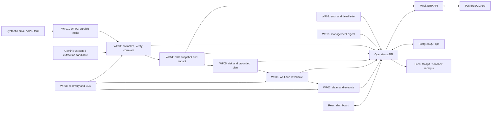

# Architecture

AI Production Incident Control separates workflow orchestration, business
transactions and synthetic ERP integration. The system uses synthetic data and
local sandbox effects. Its purpose is to make a production incident's facts,
additional operational impact, approval and execution trail inspectable.

The ten workflow keys and names are stable deployment identities. n8n exposes
the stage sequence, type routing, approval wait, recovery and error branches on
the canvas. Backend endpoints perform bounded domain commands; no endpoint
silently executes the entire incident workflow. Workflow IDs, published state
and actual executions belong to deployment manifests and evidence, rather than
being inferred from a valid JSON export.

## Runtime boundaries

| Component | Responsibility | Source |
|---|---|---|
| Operations API | Durable intake, claims, revisions, immutable assessments, plans, approvals, actions, reads and audit | `backend/main.py`, `backend/state.py` |
| Domain functions | Deterministic impact, risk, safe fixture extraction, live-candidate evidence verification, grounded plans and sales-line union | `backend/domain.py` |
| Mock ERP API | Snapshot reads and explicit approved synthetic commands | `backend/erp.py` |
| Local adapters | Internal tickets, allowlisted local mail, synthetic ERP commands, uncertain outcomes | `backend/adapters.py` |
| Dashboard | Authenticated English control center backed by the Operations API | `dashboard/` |
| PostgreSQL | Application state in `ops`/`erp`; separate n8n database | `database/migrations/`, `compose.yaml` |
| n8n runner | JavaScript execution for the selected n8n runtime | `compose.yaml` |

The base Compose profile uses a single n8n instance and its task runner. It does
not require Redis or claim to implement queue-mode scaling. Public host ports
bind to loopback. PostgreSQL and Mock ERP have no direct published host port.
Version pins are recorded in the actual Compose/dependency files; the selected
local n8n release does not establish the cloud instance's release.

## Fact and assessment flow

1. A canonical source envelope is committed together with an analysis job before
   intake returns `202`. Transport identity contains scope, source, source
   account and source ID. A changed payload for an existing transport identity
   is a conflict.
2. WF03 claims a bounded lease, obtains source and ERP context, and verifies the
   facts. Exact guided synthetic email uses the visible fixture provider. Typed
   form/API input is validated directly. An explicitly live synthetic email first
   reserves one durable call-budget slot, then Gemini returns only a candidate.
   Exact quotes, quantities, offset-aware dates and ERP identity are revalidated
   by the backend. Unknown text and ambiguous, invented or injected instructions
   require review.
3. Incident identity uses the verified business object and an active episode.
   The canonical fact fingerprint distinguishes additional corroborating sources
   from a new fact revision. Changed revisions supersede unexecuted plans and
   approvals while retaining the prior evidence.
4. WF04 compares the original schedule with the incident change using a single
   immutable ERP snapshot. Material receipts are allocated before same-time
   demand; backlog persists; own reservations remain protected. Machine analysis
   intersects outage and operation intervals and checks available alternatives.
   Quality analysis follows the verified inspection through lot allocations.
5. WF05 applies the versioned risk policy and action catalogue. The saved impact
   and risk are recalculated server-side before persistence. Unverified generated
   prose is replaced with a grounded deterministic template.
6. The plan's exact payload, revision, version and hash are approved through the
   authenticated UI. WF06's resume URL is only a wakeup mechanism; a resumed
   workflow rereads the authoritative database decision.
7. WF07 revalidates, claims and executes permitted sandbox actions. Success moves
   the response to monitoring, not automatically to incident resolution.

## Time, money and reliability

The scope clock supplies deterministic business time; timestamps include offsets
and business display uses `Asia/Bangkok`. Worker leases and n8n Wait use runtime
time. Advancing the demo clock does not alter n8n's internal clock.

Resource arithmetic uses Decimal. EUR values are integer cents. Each affected
open sales position contributes its full remaining line value once. Dashboard
aggregation uses the union of current affected sales-line IDs across open
incidents; hypothetical scenarios and closed history are excluded.

The delivery model is at least once with stable IDs, unique constraints and a
transactional outbox. Retryable analysis jobs have four total automatic attempts
and bounded backoff. A possibly accepted write becomes `UNKNOWN_OUTCOME` and is
not blindly retried. Claims and deduplication are not a universal exactly-once
guarantee for external providers.

## Evidence boundaries

[Domain test evidence](../evidence/test-results/domain.txt) and
[fixture evaluation](../evidence/evaluations/README.md) are local evidence.
[Environment discovery](implementation/environment-report.md) and the
[runtime probe](implementation/n8n-runtime-probe.md) record connector capabilities
and restrictions. Neither a deployed workflow nor a successful unit test proves
an end-to-end target execution. Refer to the current acceptance matrix and
workflow-run evidence for scenario-specific outcomes.
